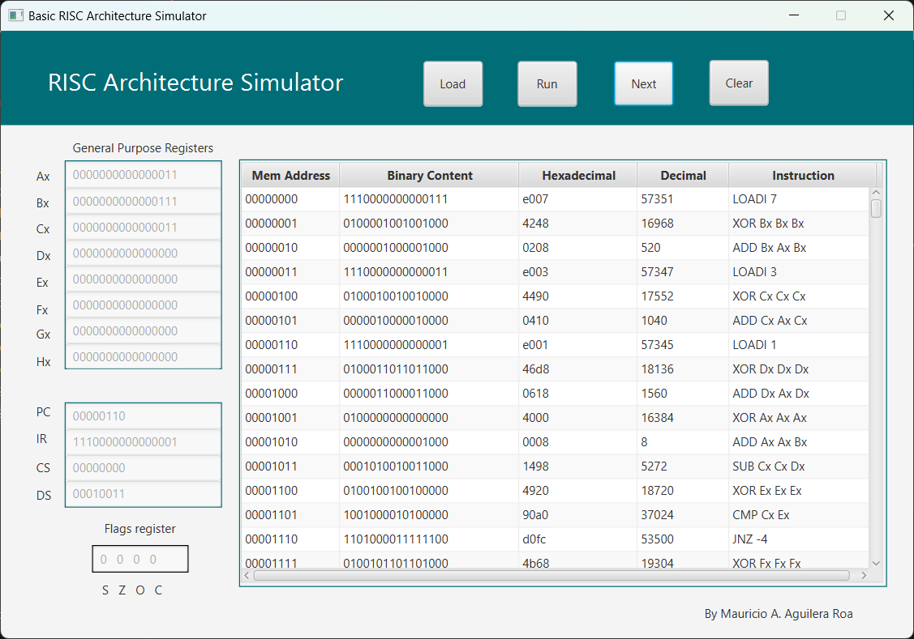

# RISC Architecture Simulator

This is a simulator for a custom RISC (Reduced Instruction Set Computing) architecture, built using Java and JavaFX for the graphical user interface. The simulator models the basic operations of a simple RISC processor, allowing you to perform and visualize operations like arithmetic, logical, memory access, and branching instructions.

## Features

- **ALU Operations**: 
  - Addition (`ADD`)
  - Subtraction (`SUB`)
  - Logical AND (`AND`)
  - Logical OR (`OR`)
  - Logical XOR (`XOR`)
  - Logical NOT (`NOT`)
  - Comparison (`CMP`)

- **Memory Operations**:
  - Load (`LOAD`)
  - Store (`STORE`)

- **Branching Instructions**:
  - Jump (`JUMP`)
  - Conditional Jump (Zero - `JZ`, Non-Zero - `JNZ`)

- **Shift Operations**:
  - Shift Left (`SHL`)
  - Shift Right (`SHR`)

- **Program Counter Management**: 
  - The simulator tracks the program counter and updates it after every instruction execution.

- **Interface**: 
  - A user-friendly JavaFX interface to interact with the simulator and observe the execution of instructions in real-time.

    

## Setup

1. Clone this repository:
   ```bash
   git clone https://github.com/MauricioART/RISC-Architecture-Simulator.git
   ```

2. Compile and run the project:
   - You can use your favorite IDE (e.g., IntelliJ IDEA, Eclipse) to import the project and run it.
   - Alternatively, use Maven or Gradle to manage dependencies and build the project from the command line.

## Usage

Once the simulator is running, you can input instructions into the interface and observe the effects on the CPU state, including registers, flags, and memory. The operations performed by the simulator are similar to the ones defined in the `ALUnit` class. Here's an overview of the methods available:

### ALU Methods

- **add**: Adds two registers and stores the result in a destination register.
- **sub**: Subtracts the second register from the first and stores the result.
- **and**: Performs a bitwise AND on two registers and stores the result.
- **or**: Performs a bitwise OR on two registers and stores the result.
- **xor**: Performs a bitwise XOR on two registers and stores the result.
- **not**: Performs a bitwise NOT on a register.
- **cmp**: Compares two registers (used for conditional branching).

### Memory and Branching Methods

- **load**: Loads a value from memory into a register.
- **store**: Stores a value from a register into memory.
- **jump**: Jump to a specific memory address.
- **jz**: Conditional jump if the Zero flag is set.
- **jnz**: Conditional jump if the Zero flag is not set.

### Shift Operations

- **shiftLeft**: Performs a left shift on a register value.
- **shiftRight**: Performs a right shift on a register value.
- **load12Bit**: Loads a 12-bit value into a register.

## Contributing

Feel free to fork the repository and make improvements! If you find any bugs or have ideas for enhancements, please open an issue or submit a pull request.

## License

This project is open-source and available under the [MIT License](LICENSE).

## Contact

If you have any questions or suggestions, you can reach out to the project owner:

- **Mauricio A. Aguilera Roa**
- GitHub: [MauricioART](https://github.com/MauricioART)
